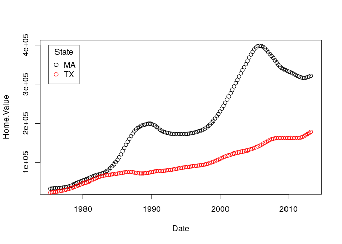
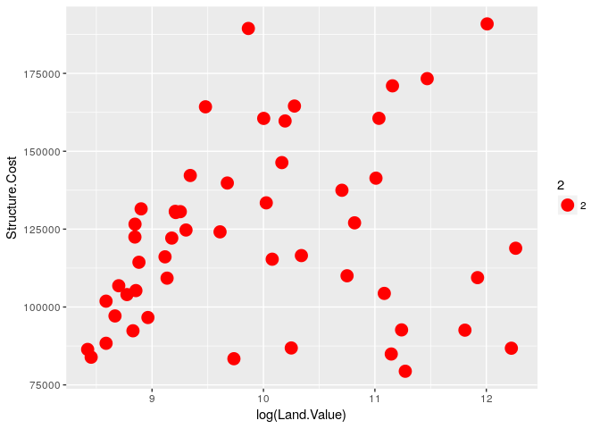
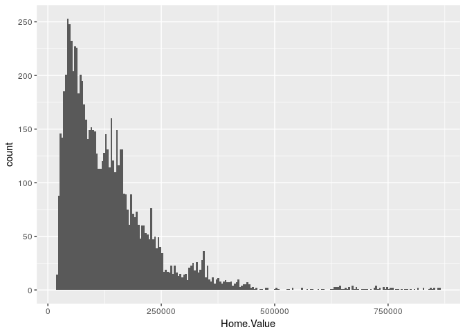
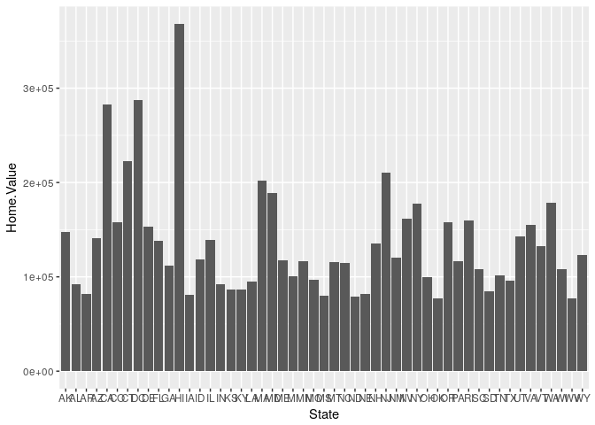
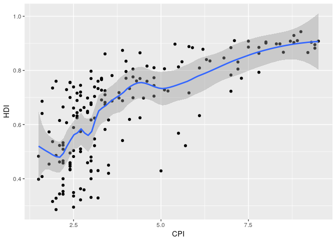

help.search("geom\_", package = "ggplot2")
==========================================

You can get a list of available geometric objects using the code.
=================================================================

    housing <- read.csv("dataSets/landdata-states.csv")
    head(housing[1:5])

    ##   State region    Date Home.Value Structure.Cost
    ## 1    AK   West 2010.25     224952         160599
    ## 2    AK   West 2010.50     225511         160252
    ## 3    AK   West 2009.75     225820         163791
    ## 4    AK   West 2010.00     224994         161787
    ## 5    AK   West 2008.00     234590         155400
    ## 6    AK   West 2008.25     233714         157458

    hist(housing$Home.Value)

    library(ggplot2)

    ggplot(housing, aes(x = Home.Value)) + geom_histogram()

    ## `stat_bin()` using `bins = 30`. Pick better value with `binwidth`.

    plot(Home.Value ~ Date,
         data=subset(housing, State == "MA"))
    points(Home.Value ~ Date, col="red",
           data=subset(housing, State == "TX"))
    legend(1975, 400000,
           c("MA", "TX"), title="State",
           col=c("black", "red"),
           pch=c(1, 1))

    ggplot(subset(housing, State %in% c("MA", "TX")),
           aes(x=Date,
               y=Home.Value,
               color=State))+
      geom_point()

    hp2001Q1 <- subset(housing, Date == 2001.25) 
    ggplot(hp2001Q1,
           aes(y = Structure.Cost, x = Land.Value)) +
      geom_point()

    ggplot(hp2001Q1,
           aes(y = Structure.Cost, x = log(Land.Value))) +
      geom_point()

    hp2001Q1$pred.SC <- predict(lm(Structure.Cost ~ log(Land.Value), data = hp2001Q1))

    p1 <- ggplot(hp2001Q1, aes(x = log(Land.Value), y = Structure.Cost))

    p1 + geom_point(aes(color = Home.Value)) +
      geom_line(aes(y = pred.SC))

    p1 +
      geom_point(aes(color = Home.Value)) +
      geom_smooth()

    ## `geom_smooth()` using method = 'loess'

    p1 + 
      geom_text(aes(label=State), size = 3)

    library("ggrepel")
    p1 + 
      geom_point() + 
      geom_text_repel(aes(label=State), size = 3)

    p1 +
      geom_point(aes(size = 2),# incorrect! 2 is not a variable
                 color="red") # this is fine -- all points red

    p1 +
      geom_point(aes(color=Home.Value, shape = region))

    ## Warning: Removed 1 rows containing missing values (geom_point).

Exercise 1.
===========

    dat <- read.csv("dataSets/EconomistData.csv")
    head(dat)

    ##   X     Country HDI.Rank   HDI CPI            Region
    ## 1 1 Afghanistan      172 0.398 1.5      Asia Pacific
    ## 2 2     Albania       70 0.739 3.1 East EU Cemt Asia
    ## 3 3     Algeria       96 0.698 2.9              MENA
    ## 4 4      Angola      148 0.486 2.0               SSA
    ## 5 5   Argentina       45 0.797 3.0          Americas
    ## 6 6     Armenia       86 0.716 2.6 East EU Cemt Asia

    ggplot(dat, aes(x = CPI, y = HDI, size = HDI.Rank)) + geom_point()

    args(geom_histogram)

    ## function (mapping = NULL, data = NULL, stat = "bin", position = "stack", 
    ##     ..., binwidth = NULL, bins = NULL, na.rm = FALSE, show.legend = NA, 
    ##     inherit.aes = TRUE) 
    ## NULL

    args(stat_bin)

    ## function (mapping = NULL, data = NULL, geom = "bar", position = "stack", 
    ##     ..., binwidth = NULL, bins = NULL, center = NULL, boundary = NULL, 
    ##     breaks = NULL, closed = c("right", "left"), pad = FALSE, 
    ##     na.rm = FALSE, show.legend = NA, inherit.aes = TRUE) 
    ## NULL

    p2 <- ggplot(housing, aes(x = Home.Value))
    p2 + geom_histogram()

    ## `stat_bin()` using `bins = 30`. Pick better value with `binwidth`.

    p2 + geom_histogram(stat = "bin", binwidth=4000)

    housing.sum <- aggregate(housing["Home.Value"], housing["State"], FUN=mean)
    rbind(head(housing.sum), tail(housing.sum))

    ##    State Home.Value
    ## 1     AK  147385.14
    ## 2     AL   92545.22
    ## 3     AR   82076.84
    ## 4     AZ  140755.59
    ## 5     CA  282808.08
    ## 6     CO  158175.99
    ## 46    VA  155391.44
    ## 47    VT  132394.60
    ## 48    WA  178522.58
    ## 49    WI  108359.45
    ## 50    WV   77161.71
    ## 51    WY  122897.25

    ggplot(housing.sum, aes(x=State, y=Home.Value)) + 
      geom_bar(stat="identity")

Exercise 2.
===========

    dat <- read.csv("dataSets/EconomistData.csv")
    head(dat)

    ##   X     Country HDI.Rank   HDI CPI            Region
    ## 1 1 Afghanistan      172 0.398 1.5      Asia Pacific
    ## 2 2     Albania       70 0.739 3.1 East EU Cemt Asia
    ## 3 3     Algeria       96 0.698 2.9              MENA
    ## 4 4      Angola      148 0.486 2.0               SSA
    ## 5 5   Argentina       45 0.797 3.0          Americas
    ## 6 6     Armenia       86 0.716 2.6 East EU Cemt Asia

    ggplot(dat, aes(x = CPI, y = HDI)) +
      geom_point() +
      #2 geom_smooth()
      #3. geom_smooth(method = "lm")
     #4 geom_smooth(stat = "smooth", method="loess")
    #5
      geom_smooth(span = .3)

    ## `geom_smooth()` using method = 'loess'

Exercise 3.
===========

    dat <- read.csv("dataSets/EconomistData.csv")
    head(dat)

    ##   X     Country HDI.Rank   HDI CPI            Region
    ## 1 1 Afghanistan      172 0.398 1.5      Asia Pacific
    ## 2 2     Albania       70 0.739 3.1 East EU Cemt Asia
    ## 3 3     Algeria       96 0.698 2.9              MENA
    ## 4 4      Angola      148 0.486 2.0               SSA
    ## 5 5   Argentina       45 0.797 3.0          Americas
    ## 6 6     Armenia       86 0.716 2.6 East EU Cemt Asia

    ggplot(dat, aes(x = CPI, y = HDI, color = "Region")) +
      geom_point() +
    scale_x_continuous(name = "Corruption Perception Index") +
    scale_y_continuous(name = "Human Development Index") +
     scale_color_manual(name = "Region of the world",
                         values = c("#24576D",
                                    "#099DD7",
                                    "#28AADC",
                                    "#248E84",
                                    "#F2583F",
                                    "#96503F"))

